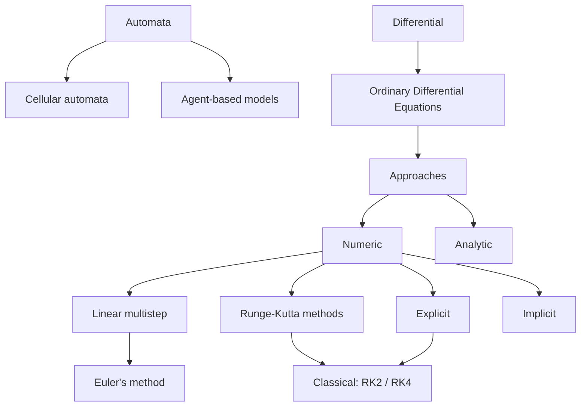

# Simulation

Goal: understand how to simulate oribital mechanics; guidance, navigation, and control (GNC); and embedded motion systems.

## Outstanding questions

* What are the different approaches to simulation?

## Classification

* Static / dynamic - with regard to time, models are dynamic if time is involved and values change over time
* Probalistic / deterministic - these classify two things: the behavior being modeled and the model's execution
* Discrete / continuous - if the simulation progresses in steps, or if time proceeds independently from simulation looping

## Design process

* Analyze - start by classifying thing being modeled
* Create formula for model:
* * collect data
* * make assumptions to simplify the problem
* * choose indepenent / dependent variables
* * understand relationships between variables / submodels
* * come up with equations and functions
* Simulate - solve the model; go back and simplify if this isn't practical
* Verify (*does solution work correctly) and validate (does solution solve the problem)
* Iterate:
* * Understand limitations
* * Understand implications of solution
* * Simplify / refine

## Types of problems

* System dynamics w/ rate proportional to amount: e.g. population growth
* Force and motion
* System dynamics with interactions: e.g. predator-prey

## Error

This is super important!

Types of errors:
* Data Errors
* Modeling Errors
* Implementation Errors 
* Precision 
* Absolute and Relative Errors 
* Round-off Error 
* Overflow and Underflow 
* Arithmetic Errors 
* Truncation Error

Other concerns:
* Comparison of Floating-Point Numbers 
* Violation of Numeric Properties 
* Error Propagation

Perform a [sensitivity analysis](https://en.wikipedia.org/wiki/Sensitivity_analysis) and [uncertainty analysis](https://en.wikipedia.org/wiki/Uncertainty_analysis).

## Approaches / techniques

