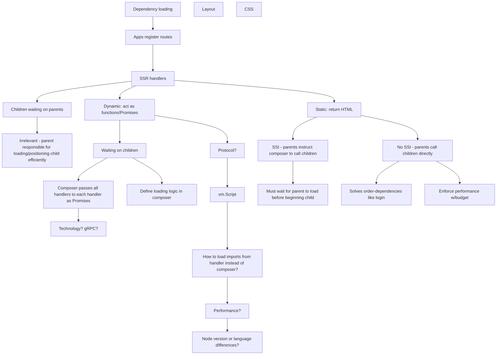
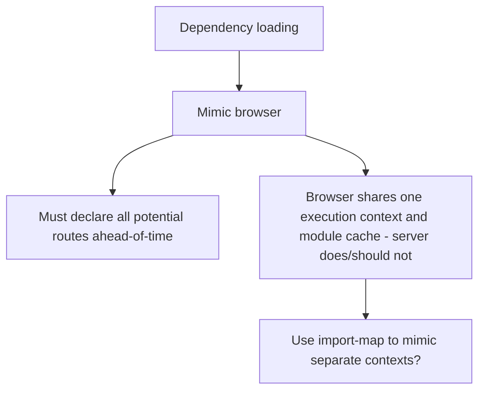

# Thoughts

* Do we really need to continue using frameworks designed to manage the entire page?
* After accepting Web Components as integration layer, how to improve server-side world?






## Google Cloud (GCP)

Recommended cluster config:

* 1 node-pool with 2x n-normal-1 – these cost $$, so shutdown when not in-use
* 1 node-pool with 1x f-micro – this is free, so just leave it running

Instructions:

* [Download Istio and add bin/ to PATH](https://istio.io/docs/setup/kubernetes/download-release/)
* [Setup GKE](https://istio.io/docs/setup/kubernetes/platform-setup/gke/)
* [Install minimal control plane](https://istio.io/docs/setup/kubernetes/minimal-install/#see-also) - see helm template command below
* [Verify control plane is running](https://istio.io/docs/setup/kubernetes/quick-start/#verifying-the-installation)
* Change imageName in skaffold.yaml and image in deployment.yml Deployments to match container registry (e.g. gcr.io/johntron/composer)
* Follow instructions in "Running"
* Get IP address of ingress and open http://<ingress IP>/info


## Run locally with Minikube

* Install Docker, minikube (optional), and skaffold
* Launch minikube with `minikube start`
* Optionally start minikube dashboard with `minikube dashboard`
* Change deployments to use NodePort.
* Follow instructions in "Running"
* Expose service and open in http://<exposed IP>/info


## Running

* Inject sidecar with: istioctl kube-inject -f deployment.yml > deployment-with-sidecar.yml
* Run `skaffold dev`


## Cleaning up

* Kill `skaffold dev` - it'll remove app deployment automatically
* `kubectl delete -f istio-minimal.yaml`
* Scale down k8s cluster with `gcloud compute instance-groups managed resize`


## Using helm template to generate minimal install

```
cd istio-1.0.5
helm template install/kubernetes/helm/istio --name istio --namespace istio-system \
  --set security.enabled=false \
  --set ingress.enabled=true \
  --set gateways.istio-ingressgateway.enabled=true \
  --set gateways.istio-egressgateway.enabled=false \
  --set galley.enabled=false \
  --set sidecarInjectorWebhook.enabled=false \
  --set mixer.enabled=false \
  --set prometheus.enabled=false \
  --set global.proxy.envoyStatsd.enabled=false \
  --set pilot.sidecar=false > istio-minimal.yaml
```


## Todo

* Finish trying Bazel? https://docs.bazel.build/versions/master/build-javascript.html#step-2-installing-ibazel and https://github.com/bazelbuild/rules_nodejs